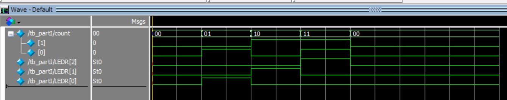

# Lab 1 Report

## Part 1

I created a basic logic with switches and LEDR based on the following truth table.

| SW1 | SW0 | LEDR[2] | LEDR[1] | LEDR[0] |
| ---:| ---:| ---:| ---:| ---:|
| 0 | 0 | 0 | 0 | 0 |
| 0 | 1 | 0 | 0 | 1 |
| 1 | 0 | 0 | 1 | 0 |
| 1 | 1 | 1 | 0 | 0 |

SW[1:0] represent the binary input, and LEDR[2:0] represent the decimal output. For example, when SW1 = 1 and SW0 = 1, 3 is the decimal representation of the binary 11, so LEDR[2] lights up because it's the third LEDR.

## Part 2

### HEX0

| SW3 | SW2 | SW1 | SW0 | HEX0[7] | HEX0[6] | HEX0[5] | HEX0[4] | HEX0[3] | HEX0[2] | HEX0[1] | HEX0[0] |
| ---:| ----:| ---:| ---:| ---:| ---:|---:| ---:| ---:| ---:| ---:| ---:|
| 0 | 0 | 0 | 0 |  1|1|0|0|0|0|0|0|
| 0 | 0 | 0 | 1 |  1|1|1|1|1|0|0|1|
| 0 | 0 | 1 | 0 |  1|0|1|0|0|1|0|0|
| 0 | 0 | 1 | 1 |  1|0|1|1|0|0|0|0|
| 0 | 1 | 0 | 0 |  1|0|0|1|1|0|0|1|
| 0 | 1 | 0 | 1 |  1|0|0|1|0|0|1|0|
| 0 | 1 | 1 | 0 |  1|0|0|0|0|0|1|0|
| 0 | 1 | 1 | 1 |  1|1|1|1|1|0|0|0|
| 1 | 0 | 0 | 0 |  1|0|0|0|0|0|0|0|
| 1 | 0 | 0 | 1 |  1|0|0|1|1|0|0|0|
| 1 | 0 | 1 | 0 |  1|1|0|0|0|0|0|0|
| 1 | 0 | 1 | 1 |  1|1|1|1|1|0|0|1|
| 1 | 1 | 0 | 0 |  1|0|1|0|0|1|0|0|
| 1 | 1 | 0 | 1 |  1|0|1|1|0|0|0|0|
| 1 | 1 | 1 | 0 |  1|0|0|1|1|0|0|1|
| 1 | 1 | 1 | 1 |  1|0|0|1|0|0|1|0|

**Output Equations**

HEX0[7] = 1

HEX0[6] = (!SW[3] & !SW[2] & !SW[1]) | (SW[3] & !SW[2] & SW[1]) | (!SW[3] & SW[2] & SW[1] & SW[0])

HEX0[5] = (!SW[3] & !SW[2] & SW[0]) | (!SW[3] & !SW[2] & SW[1]) | (!SW[3] & SW[1] & SW[0]) | (!SW[2] & SW[1] & SW[0]) | (SW[3] & SW[2] & !SW[1])

HEX0[4] = (SW[0]) | (!SW[3] & SW[2] & !SW[1]) | (SW[3] & SW[2] & SW[1])

HEX0[3] = (!SW[2] & !SW[1] & SW[0]) | (SW[3] & !SW[2] & SW[0]) | (!SW[3] & SW[2] & !SW[1] & !SW[0]) | (!SW[3] & SW[2] & SW[1] & SW[0]) | (SW[3] & SW[2] & SW[1] & !SW[0])

HEX0[2] = (!SW[3] & !SW[2] & SW[1] & !SW[0]) | (SW[3] & SW[2] & !SW[1] & !SW[0])

HEX0[1] = (!SW[3] & SW[2] & !SW[1] & SW[0]) | (!SW[3] & SW[2] & SW[1] & !SW[0]) | (SW[3] & SW[2] & SW[1] & SW[0])

HEX0[0] = (!SW[3] & !SW[2] & !SW[1] & SW[0]) | (!SW[3] & SW[2] & !SW[1] & !SW[0]) | (SW[3] & !SW[2] & SW[1] & SW[0]) | (SW[3] & SW[2] & SW[1] & !SW[0])

### HEX1

| SW3 | SW2 | SW1 | SW0 | HEX1[7] | HEX1[6] | HEX1[5] | HEX1[4] | HEX1[3] | HEX1[2] | HEX1[1] | HEX1[0] |
| ---:| ----:| ---:| ---:| ---:| ---:|---:| ---:| ---:| ---:| ---:| ---:|
| 0 | 0 | 0 | 0 |  1|1|0|0|0|0|0|0|
| 0 | 0 | 0 | 1 |  1|1|0|0|0|0|0|0|
| 0 | 0 | 1 | 0 |  1|1|0|0|0|0|0|0|
| 0 | 0 | 1 | 1 |  1|1|0|0|0|0|0|0|
| 0 | 1 | 0 | 0 |  1|1|0|0|0|0|0|0|
| 0 | 1 | 0 | 1 |  1|1|0|0|0|0|0|0|
| 0 | 1 | 1 | 0 |  1|1|0|0|0|0|0|0|
| 0 | 1 | 1 | 1 |  1|1|0|0|0|0|0|0|
| 1 | 0 | 0 | 0 |  1|1|0|0|0|0|0|0|
| 1 | 0 | 0 | 1 |  1|1|0|0|0|0|0|0|
| 1 | 0 | 1 | 0 |  1|1|1|1|1|0|0|1|
| 1 | 0 | 1 | 1 |  1|1|1|1|1|0|0|1|
| 1 | 1 | 0 | 0 |  1|1|1|1|1|0|0|1|
| 1 | 1 | 0 | 1 |  1|1|1|1|1|0|0|1|
| 1 | 1 | 1 | 0 |  1|1|1|1|1|0|0|1|
| 1 | 1 | 1 | 1 |  1|1|1|1|1|0|0|1|

**Output Equations**

HEX1[7] = 1

HEX1[6] = 1

HEX1[5] = (SW[3] & SW[1]) | (SW[3] & SW[2])

HEX1[4] = HEX1[5]

HEX1[3] = HEX1[5]

HEX1[2] = 0

HEX1[1] = 0

HEX1[0] = HEX1[5]

### Simulation
