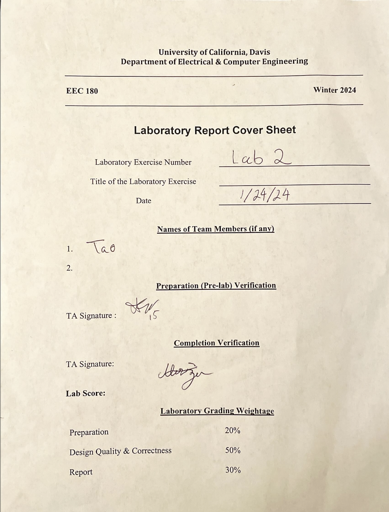

# EEC180 Lab2 Report



## Pre-Lab

Boolean Equation of a 2-bit Full-Adder

co = (a & b) | (a & ci) | (b & ci)
s = a ^ b ^ ci

**Structural Model**
* The Structural Model builds the actual gate structure in Verilog.

```
module seg_decoder (
    input
        [0] a,
        [0] b,
        [0] ci;
    output 
        [0] s,
        [0] co;
);

co = (a & b) | (a & ci) | (b & ci)
s = a ^ b ^ ci

endmodule
```

**Behavioral Model**
* The Behavioral Model models the behavior of the gates with boolean equations without building the gates.

```
a + b
```

## Part I

**1-Bit Full Adder**
| a | b | cin | sum | cout |
| --:|--:|--:|--:|--:|
| 0 | 0 | 0 | 0 | 0 |
| 0 | 0 | 1 | 1 | 0 |
| 0 | 1 | 0 | 1 | 0 |
| 0 | 1 | 1 | 0 | 1 |
| 1 | 0 | 0 | 1 | 0 |
| 1 | 0 | 1 | 0 | 1 |
| 1 | 1 | 0 | 0 | 1 |
| 1 | 1 | 1 | 1 | 1 |

In Verilog, we could use ```assign {cout, sum} = a + b + cin``` to model the behavior of the 1-bit adder instead of solving this truth table.

**8-Bit Full Adder**

After building the 1-bit adder, we could cascade them to build the 8-bit adder.


**When does the adder overflow?**
* When a[7] and b[7] are 1 and sum[7] is 0.
* When a[7] and b[7] are 0 and sum[7] is 1.

| a[7] | b[7] | sum[7] | overflow |
| ---: | ----:| ----:| ---: |
| 0 | 0 | 0 | 0 |
| 0 | 0 | 1 | 1 |
| 0 | 1 | 0 | 0 |
| 0 | 1 | 1 | 0 |
| 1 | 0 | 0 | 0 |
| 1 | 0 | 1 | 0 |
| 1 | 1 | 0 | 1 |
| 1 | 1 | 1 | 0 |

**Output Equation**

overflow = (!a[7] & !b[7] & sum[7]) | (a[7] & b[7] & !sum[7])

**ModelSim Transcript**
```
# Loading work.tBench
# Loading work.partI_add
# Loading work.fAdder
run -all
# Testing Begins:
# Error:           0
# number of Test Cases: 131072
```

## Part II

I combined two AND gates with a full adder to create a mult unit, then combine 4 of them to create a mult4 unit, which represents a row in the multiplication circuitry.

I used another module, myMultiplier, to package mult4 in three rows and complete the multiplier circuit.

**ModelSim Transcript**
```
# Loading work.testbench
# Loading work.myMultiplier
# Loading work.mult4
# Loading work.mult
run -all
# Test Begins:
# Conducted 256 Tests
# 
#           0 Error
```

## Part III

In partIII of the lab, I created a generic adder by using the generate statement and a genvar, i.

One thing to note is that we need to set the carry in for the first bit as 0, and the carry out of the last bit as the carry out output. All other bits could be properly assigned within the for loop.

**ModelSim Transcript**
```
# Loading work.testBench
# Loading work.genAdder
# Loading work.fAdder
run -all
# Test for N =           9
# Number of Test = 262144
# Error =           0
```

### Encountered Issues
1. Don't feed 0 for the 1-bit ground 0. In Verilog, a 0 without specifying the bitwidth will be a 32-bit integer, and it causes a compilation problem if the program treats it as a 1-bit 0. 
2. When writing a for loop in Verilog, be careful of the terminating condition. For example, if a loop iterates a register, ```[1:0]test```, from 0 to 3 to test all possible inputs, ```for (test = 0; test < 4; test++)```, the test could become ```2'b11```. If the loop adds 1 to it, it goes to 0 and NOT 4, which leads to an **infinite loop.**